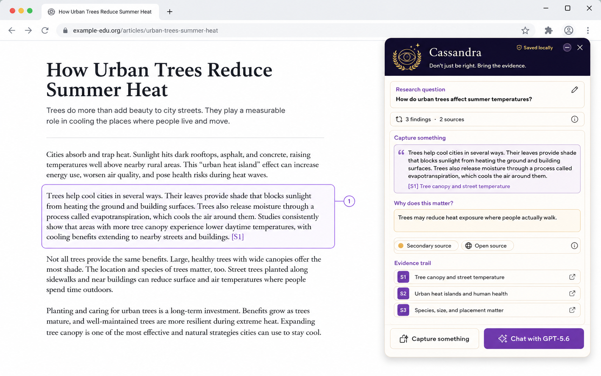

# Cassandra



> **Don't just be right. Bring the evidence.**  
> Browse first. Ask better.

Cassandra is a local-first research companion that helps learners investigate before asking AI. Its Tampermonkey userscript lets a learner deliberately collect short, referenced evidence from public webpages, explain why each finding matters, compare sources, and prepare a source-grounded Markdown packet for GPT-5.6.

**OpenAI Build Week category:** Education

## The problem

Starting with an empty AI prompt can encourage learners to skip the useful work of finding sources, comparing claims, and deciding why evidence matters. It can also blur the line between what a source says, what the learner thinks, and what an AI infers.

Cassandra reverses that order:

**find → mark → explain → compare → ask**

Every ready finding contains a short excerpt, its original source, and a learner-written **Why does this matter?** reflection. GPT-5.6 receives that learner-created evidence trail only after the learner chooses to prepare and send it.

## What Cassandra does

1. Start a session with a research question.
2. Select text or point to a paragraph, heading, link, image reference, or table row.
3. Add the required **Why does this matter?** reflection.
4. Review the source-grouped evidence trail and source-diversity warnings.
5. Preview or export a Markdown research packet.
6. Optionally fill a visible ChatGPT composer with the packet and the Cassandra study-partner instructions.
7. Review the complete prompt and click **Send** manually.

Cassandra does not generate the learner's evidence trail. It helps them preserve and organise the trail they created themselves.

## Why this belongs in Education

Cassandra is designed to reinforce inquiry habits rather than replace them:

- trace claims back to their source;
- keep quoted evidence separate from personal reflection;
- explain why a finding is relevant;
- notice weak, missing, or overly concentrated evidence;
- ask AI to identify gaps and disagreements, not merely produce an answer;
- retain human review before any prompt is submitted.

The result is a study workflow in which GPT-5.6 acts as a partner over learner-supplied evidence rather than as a substitute for research.

## How GPT-5.6 contributes

GPT-5.6 performs the final, source-grounded study step. Cassandra prepares a Markdown packet that asks it to:

- distinguish source evidence, learner notes, and model inference;
- cite supplied source IDs such as `[S1]`;
- avoid inventing or claiming to have opened sources;
- identify disagreements, weak evidence, and unanswered questions;
- explain the synthesis at an appropriate learning level;
- recommend useful next research steps.

The learner selects GPT-5.6 in ChatGPT, clicks **Chat with GPT-5.6** in Cassandra, reviews the filled composer, and manually clicks **Send**. The courier is input-only: it never reads a response, detects completion, clicks Send, or relays Output.

Cassandra's research, citation, storage, packet-preview, and export features work without an OpenAI API key. Access to ChatGPT with GPT-5.6 is required only for the optional composer handoff.

## How Codex was used

Codex was the primary implementation partner throughout Build Week. Development was divided into bounded waves so each stage could be tested and reviewed before scope expanded.

Codex accelerated:

- the clean-room TypeScript and esbuild userscript scaffold;
- the Shadow DOM research tray and local session model;
- user-directed element capture and source-provenance extraction;
- packet generation, JSON backup/restore, and Markdown export;
- privacy exclusions and untrusted-content handling;
- the input-only ChatGPT courier;
- Vitest and Chromium/Playwright coverage for the controlled three-source scenario.

The key product and authority decisions remained human decisions:

- research must come before AI synthesis;
- every ready capture requires the learner's own relevance note;
- page content is evidence, never trusted instructions;
- data stays local unless the learner deliberately exports or prepares a prompt;
- Cassandra may fill a composer but never submit it or inspect the response;
- breadth was deliberately limited to one polished, testable userscript.

The repository's dated commit history and the Codex `/feedback` session supplied with the Devpost entry provide the Build Week development record.

## Architecture

```text
Public webpage
  └─ Cassandra Tampermonkey userscript
       ├─ user-directed capture
       ├─ source and locator extraction
       ├─ Shadow DOM research tray
       ├─ local Tampermonkey storage
       ├─ JSON / Markdown export
       └─ input-only ChatGPT prompt courier
```

There is no backend, account system, cloud database, automatic crawler, or AI-response reader.

## Supported platform

| Component | Supported/tested configuration |
|---|---|
| Operating system | Desktop Windows; the userscript itself is not intentionally OS-specific |
| Browser | Current Chromium-based desktop browser |
| Userscript manager | Tampermonkey |
| Automated browser coverage | Playwright with Chromium |
| Optional AI handoff | ChatGPT account with access to GPT-5.6 |
| Development runtime | Node.js and npm; use the version recorded in `BUILD.md` |

Other browsers and userscript managers may work but are not part of the judged/tested MVP.

## Install the test build without rebuilding

This is the recommended judging path.

1. Install Tampermonkey in a supported Chromium-based desktop browser.
2. Open [`dist/cassandra.user.js`](dist/cassandra.user.js) from this repository.
3. Choose the raw-file view if the repository host shows a source preview.
4. Tampermonkey will show its installation page; review the requested permissions and choose **Install**.
5. Open a normal public article page and confirm that the collapsed Cassandra research tray appears.

No backend, test account, API key, or source rebuild is required for the core research flow.

## Judge walkthrough

The complete path takes about two minutes:

1. Open Cassandra and create a research question.
2. On a public article, activate capture mode and select one short paragraph.
3. Add a meaningful **Why does this matter?** note and save the finding.
4. Repeat on at least one different source.
5. Open **Evidence trail** and verify that each finding retains its page title and URL.
6. Open **Packet preview** and confirm that source evidence and learner notes are visibly separate.
7. Export the Markdown packet to test the core product without ChatGPT.
8. Optional GPT-5.6 path: open ChatGPT with GPT-5.6 selected, click **Chat with GPT-5.6**, review the populated prompt, and manually click **Send**.
9. Confirm that Cassandra does not read or import the resulting response.

For a deterministic project test, follow the controlled three-source scenario in [`DEMO.md`](DEMO.md).

## Build and test from source

```powershell
npm install
npx playwright install chromium
npm run check
npm run build
```

Install the generated [`dist/cassandra.user.js`](dist/cassandra.user.js) in Tampermonkey. See [`BUILD.md`](BUILD.md) for the individual development and verification commands.

## Privacy and trust boundary

- Capture requires an explicit learner action and stops after one item or Escape.
- Password and authentication pages, form/editable content, hidden text, private-account hosts, localhost, and non-HTTP pages are excluded.
- Cassandra never captures password fields, form values, complete pages, or background browsing activity.
- Page content is sanitised, rendered as text, and labelled as untrusted evidence in the GPT prompt.
- Excerpts are capped at 800 characters.
- Packets are capped at 20 ready captures and 24,000 characters.
- The courier only writes to a visible ChatGPT composer; it never clicks Send or inspects Output.
- Imported backups are structure- and URL-validated before storage or rendering.
- Sessions remain in Tampermonkey storage until the learner explicitly exports or deletes them.

The complete boundary and threat model are documented in [`SECURITY.md`](SECURITY.md).

## Known limitations

- Page metadata quality depends on what the source publishes.
- Complex tables and highly dynamic pages may not produce a useful capture.
- Source-diversity warnings are prompts for learner judgement, not credibility scores.
- Cassandra does not verify whether a claim is true.
- The ChatGPT composer is a consumer-page integration and can change; **Copy prompt** remains the permanent fallback.
- Cassandra does not inspect, score, save, or validate GPT-5.6 responses.
- The MVP is tested on desktop Chromium with Tampermonkey only.

## Project status

Wave 4 is complete. The controlled three-source scenario, private-surface exclusions, packet limits, backup validation, and input-only courier are covered by Chromium smoke tests.

The 90-second Build Week walkthrough is in [`DEMO.md`](DEMO.md).

## Repository map

```text
src/       TypeScript userscript source
tests/     Unit and browser tests
fixtures/  Controlled educational research pages
dist/      Installable userscript build
spec/      Product specification and concept artwork
```

## Build Week submission checklist

The README covers the repository documentation requested by the [OpenAI Build Week Official Rules](https://openai.devpost.com/rules). The following submission-form items still need to be completed outside this file:

- [ ] Select the **Education** category.
- [ ] Add the project description and feature summary to Devpost.
- [ ] Upload a public YouTube demonstration with audio, under three minutes.
- [ ] Show clearly in the video how Codex and GPT-5.6 contributed.
- [ ] Provide the repository URL.
- [ ] If the repository is private, share it with `testing@devpost.com` and `build-week-event@openai.com`.
- [ ] If the repository is public, add and verify the intended open-source licence.
- [ ] Add the Codex `/feedback` Session ID for the thread in which most core functionality was built.
- [ ] Verify that all submission content and included media are owned or properly licensed.
- [ ] Test the installable `dist/cassandra.user.js` from a clean browser profile before submission.

The Official Rules and Devpost submission form remain the source of truth.
